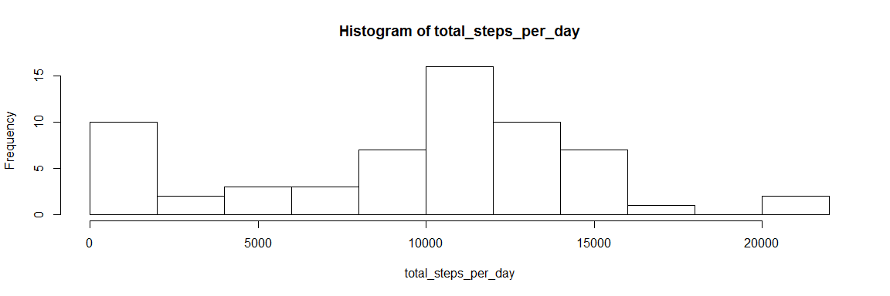
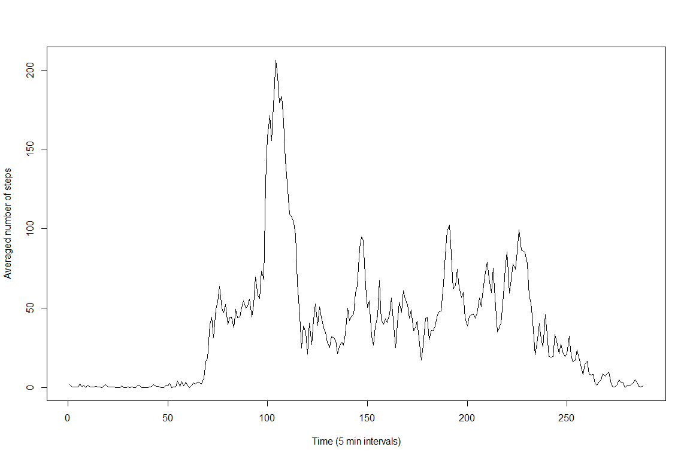
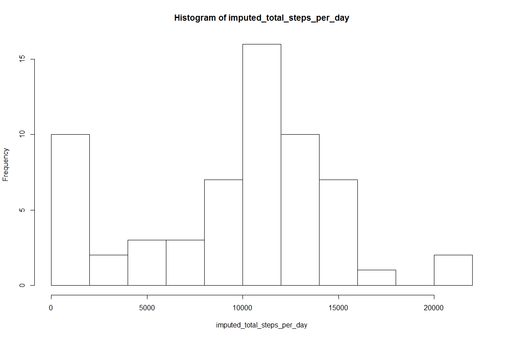
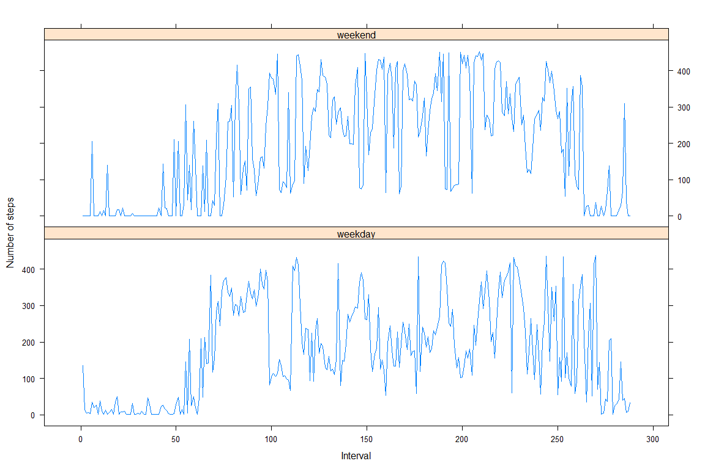

# Activity monitoring
Christoph Euler  


  

```r
  setwd("D:/Users/ceuler/Documents/DataScience/coursera/course_05_week_02/repdata_data_activity")
  dataset <- read.csv("activity.csv")
```

# Extract the mean total number of steps taken per day
### Calculate total number of steps per day

```r
  total_steps_per_day <- sapply(levels(dataset$date),function(dte){sum(dataset$steps[dataset$date==dte], na.rm=TRUE)})
```

### Histogram of total number of steps per day

```r
  hist(total_steps_per_day,breaks=15)
```

<!-- -->


### Calculate and report the mean and median of the total number of steps per day

```r
  mean_steps_per_day <- mean(total_steps_per_day)
  median_steps_per_day <- median(total_steps_per_day)
```
The mean number of steps per day is 9354.2295082. The median is 10395.


# Extract average daily activity pattern
Time series (type="l") of 5-min interval (x-axis) and the average number of steps taken, averaged across all days (y-axis)

```r
  n_days <- length(unique(dataset$date))
  time_series <- sapply(1:288, function(timestep){
    mean(sapply(1:n_days, function(day){dataset$steps[(day-1)*288+timestep]}), na.rm=TRUE)
  })
  plot(time_series, type="l",xlab = "Time (5 min intervals)", ylab = "Averaged number of steps")
```

<!-- -->

# Which 5-minute interval, on average across all the days in the dataset, contains the maximum number of steps?
Time interval 104 contains the maximum average number of steps, namely 206.1698113. 

# Impute missing values
### Calculate and report the total number of missing values in the dataset

```r
  n_NA <- length(which(is.na(dataset$steps)))
```
There are 2304 missing values in the dataset.

### Devise a strategy for filling in all of the missing values in the dataset.
Imputing missing values using the median.

### Create a new dataset that is equal to the original dataset but with the missing data filled in.

```r
  dataset_imputed <- dataset
  dataset_imputed$steps[which(is.na(dataset_imputed$steps))] <- median(dataset_imputed$steps,na.rm=TRUE)
```

### Make a histogram of the total number of steps taken each day and Calculate and report the mean and median total number of steps taken per day.

```r
  imputed_total_steps_per_day <- sapply(levels(dataset_imputed$date),function(dte){sum(dataset_imputed$steps[dataset_imputed$date==dte], na.rm=TRUE)})
  hist(imputed_total_steps_per_day,breaks=15)
```

<!-- -->

```r
  imputed_mean_steps_per_day <- mean(imputed_total_steps_per_day)
  imputed_median_steps_per_day <- median(imputed_total_steps_per_day)
```
In the imputed dataset, the mean number of steps per day is 9354.2295082. The median is 1.0395\times 10^{4}.

### Do these values differ from the estimates from the first part of the assignment? 
The median is equal (since I imputed using the mean), while the mean has shifted.

### What is the impact of imputing missing data on the estimates of the total daily number of steps?
Imputing missing data naturally increases the total number of steps per day.

# Are there differences in activity patterns between weekdays and weekends?
Create a new factor variable in the dataset with two levels - "weekday" and "weekend" indicating whether a given date is a weekday or weekend day (use weekdays())


### Make a panel plot containing a time series plot (i.e. type = "l") of the 5-minute interval (x-axis) and the average number of steps taken, averaged across all weekday days or weekend days (y-axis)

```r
  require(lattice)
  weekend_steps <- dataset_imputed$steps[dataset_imputed$weekend_flag=="weekend"]
  imputed_n_days <- length(unique(dataset_imputed$date[dataset_imputed$weekend_flag=="weekend"]))
  imputed_time_series_weekend <- sapply(1:288, function(timestep){
    mean(sapply(1:imputed_n_days, function(day){weekend_steps[(day-1)*288+timestep]}), na.rm=TRUE)
  })
  weekday_steps <- dataset_imputed$steps[dataset_imputed$weekend_flag=="weekday"]
  imputed_n_days <- length(unique(dataset_imputed$date[dataset_imputed$weekend_flag=="weekday"]))
  imputed_time_series_weekday <- sapply(1:288, function(timestep){
    mean(sapply(1:imputed_n_days, function(day){weekday_steps[(day-1)*288+timestep]}), na.rm=TRUE)
  })
  time_series_steps <- c(imputed_time_series_weekday, imputed_time_series_weekend)
  time_series_day <- c(rep("weekday",length(imputed_time_series_weekday)),rep("weekend",length(imputed_time_series_weekend)))
  time_series <- data.frame(cbind(as.numeric(time_series_steps), time_series_day))
  colnames(time_series)[1] <- "steps"
  time_series$steps <- as.numeric(time_series$steps)
  xyplot(time_series$steps~c(1:288,1:288) | factor(time_series$time_series_day), layout=c(1,2), xlab="Interval", ylab="Number of steps", type="l")
```

<!-- -->
